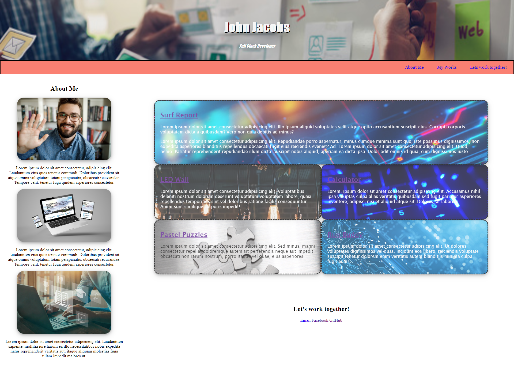
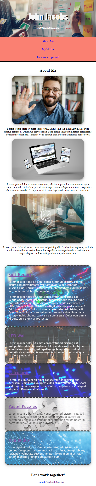

# Portfolio
# Homework 2: Portfolio

----
## Overiew
---

This is the second assignment completeted for my U of M full-stack boot camp. in this project, I am asked to build a portfolio website showcasing my skills thus far.

I found that this project demanded alot out of me. 

## Objective

Build a Portfolio website that showcases elements learned in unit 2.

## Screen Shot

---
2021  W3HT

